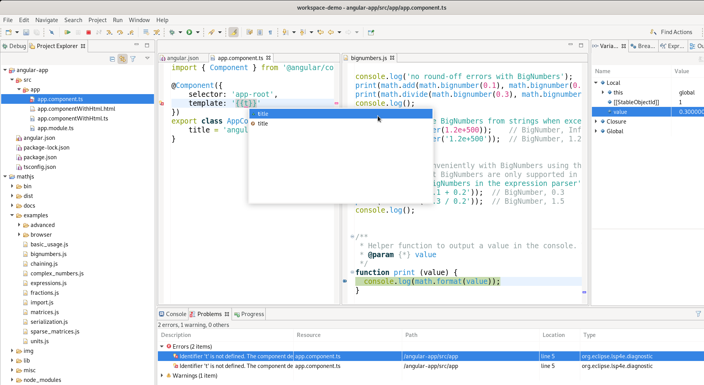

# Eclipse Wild Web Developer : 🌐 Web dev in Eclipse IDE 🌘

🖊️ **Edit** of HTML, CSS, JavaScript, TypeScript, JSON+schema, XML+schema, YAML+schema+Kubernetes and 🦟🔫 **debug** Node.js and HTML+JS web-apps simply and efficiently in the 🌘 Eclipse IDE.

To see it in action, open the desired file with the Generic Editor that's included by default in the Eclipse IDE.

Rich 🖊️edition for:

* HTML
* CSS, SCSS, SASS, LESS
* JavaScript / ECMAScript
* TypeScript
* JSON (including schema support)
* YAML (including schema support, Kubernetes schema built-in)
* XML (including schema support), XSL, XSD, DTD, RelaxNG

and

* Kubernetes
* Angular (Components & Templates, in TypeScript and HTML files)
* React (JSX, TSX, embedded HTML)
* ESLint (for JavaScript and TypeScript)
* Vue.js

Supported features for edition are

* Validation (diagnostics, markers)
* Code Completion
* Hover
* Outline
* Rename refactoring
* Jump to declaration
* Find references
* Color preview
* ... and other features part of the Language Server Protocol

Supported 🦟🔫 debugging targets

* Node.js
* 🔥🦊 Firefox
* Chromium / Chrome

## 📥 Get it Now!

* With Eclipse Marketplace Client and https://marketplace.eclipse.org/content/wild-web-developer-html-css-javascript-typescript-nodejs-angular-json-yaml-kubernetes-xml, choose one of:
  * [Click here to install](https://mickaelistria.github.io/redirctToEclipseIDECloneCommand/redirectToMarketplace.html?entryId=5578890)
  * *Help > Eclipse Marketplace*, search `Wild Web Developer` then click `Install` or
  * drag  into Eclipse IDE

or

* With [Help > Install New Software...](https://help.eclipse.org/latest/topic/org.eclipse.platform.doc.user/tasks/tasks-124.htm) with p2 repo https://download.eclipse.org/wildwebdeveloper/snapshots

## 🎬 Media Library

♨️ See [Release Notes](RELEASE_NOTES.md) for details about recent major improvement in the project.

▶️ [January 2020] Quick and complete demo of Wild Web Developer and related strategy about Language Server and Debug Adapters at FOSDEM https://fosdem.org/2020/schedule/event/lspdebug/

▶️ [January 2020] Demo of ESLint in Wild Web Developer https://youtu.be/o-wI_niEz3E

▶️ [October 2019] Demo debugging JavaScript in HTML with Chrome https://youtu.be/6L071ZtnUOk

▶️ [October 2019] Demo Angular template edition assistance https://www.screencast.com/t/6GTi4jf6svR

▶️ [September 2019] Demo debugging JavaScript in HTML with Firefox https://www.youtube.com/watch?v=4Q_-CtvsEjY

📰 [June 2019] [The Eclipse IDE for Web and JavaScript developers strikes back](https://www.eclipse.org/community/eclipse_newsletter/2019/june/eclipsetldr.php) on Eclipse Foundation newsletter.

▶️ [Jun 2019] Demo of Terminal and Build integration for NPM: https://www.screencast.com/t/BbWiKutjYI95

📰 [Apr 2019] [Eclipse Wild Web Developer adds a powerful YAML editor with built-in Kubernetes support](https://developers.redhat.com/blog/2019/04/10/eclipse-wild-web-developer-adds-a-powerful-yaml-editor-with-built-in-kubernetes-support/) on Red Hat Developers blog

▶️ [Mar 2019] Demo of YAML editor support: https://youtu.be/P9ETtuHiUco

▶️ [Feb 2019] Demo of XML editor support: https://youtu.be/fikUdUZFdzg

▶️ [Jan 2019] Demo of Node.js launch and debug: https://www.screencast.com/t/0QRpxSA3M7Qy

▶️ [Apr 2017] XML, JSON, CSS, JavaScript, TypeScript demo http://www.screencast.com/t/BaC9DxHIqD

## 💡 Design and Architecture

Wild Web Developer is based on the Eclipse Generic Editor framework from [Eclipse Platform](https://projects.eclipse.org/projects/eclipse.platform), [Eclipse LSP4E](https://projects.eclipse.org/projects/technology.lsp4e) and [Eclipse TM4E](https://github.com/eclipse/tm4e) in order to provide editors based on TextMate grammars, Visual Studio Code HTML CSS & JSON Language Servers, Theia's [TypeScript and JavaScript language servers](https://github.com/theia-ide/typescript-language-server), Red Hat's [xml-languageserver](https://github.com/angelozerr/lsp4xml) and [yaml-language-server](https://github.com/redhat-developer/yaml-language-server/)...; and on Eclipse Debug stack, LSP4E Debug Adapter Protocol support and Visual Studio Code Node Debug Adapter... to provide debugging.

## ⌨️ Get involved

See [contribution guide](CONTRIBUTING.md).
