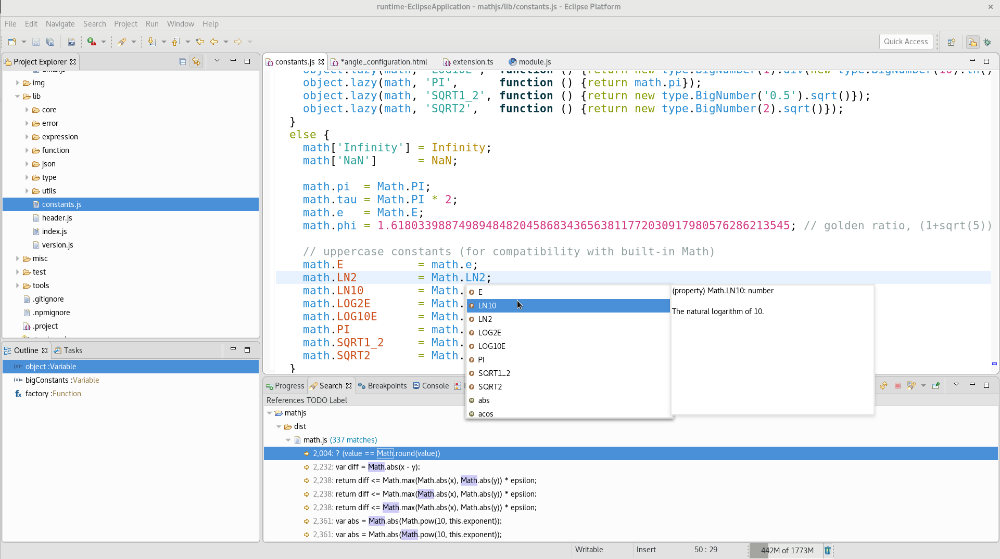

# Eclipse Wild Web Developer : 🌐 Web dev in Eclipse IDE 🌘

Eclipse Wild Web Developer is a set of functionalities for the Eclipse IDE to provide simple and efficient Web development (HTML, CSS, JS, JSon, Node.js, XML...). It's meant to be an alternative to traditional Eclipse Web Tools Platform (WTP).

Wild Web Developer is based on the Eclipse Generic Editor framework from Eclipse Platform, LSP4E and TM4E in order to provide editors based on TextMate grammars, VSCode Language Server, xml-languageserver, and on Eclipse Debug stack, LSP4E Debug Adapter Protocol support and VSCode Node Debug Adapter to provide debugging.

## ⬇️ Installation

Install into Eclipse IDE (pick one way or another):
* With Eclipse Marketplace Client and https://marketplace.eclipse.org/content/wild-web-developer-web-development-eclipse-ide-experimental, choose one of:
  * *Help > Eclipse Marketplace*, search `Wild Web Developer` then click `Install` or
  * drag  into Eclipse IDE, or
* With [Help > Install New Software...](http://help.eclipse.org/neon/index.jsp?topic=%2Forg.eclipse.platform.doc.user%2Ftasks%2Ftasks-124.htm) with p2 repo http://download.eclipse.org/wildwebdeveloper/snapshots

In an Eclipse target platform definition:
* Use http://download.eclipse.org/wildwebdeveloper/snapshots p2 repo

## ⌨️ Get involved

Community support is currently available via [GitHub issues](https://github.com/eclipse/wildwebdeveloper/issues).

Contribution of Code and Documentation are welcome as [GitHub Pull Request](https://github.com/eclipse/wildwebdeveloper/pulls).

Continuous integration is available on https://jenkins.eclipse.org/wildwebdeveloper/

Quality analysis is available on [SonarCloud](https://sonarcloud.io/dashboard?id=eclipse-wildwebdeveloper).

## 🎬 Video Library
▶️ [Mar 2019] Demo of YAML editor support: https://youtu.be/P9ETtuHiUco

▶️ [Feb 2019] Demo of XML editor support: https://youtu.be/fikUdUZFdzg

▶️ [Apr 2017] http://www.screencast.com/t/BaC9DxHIqD (old) demo
