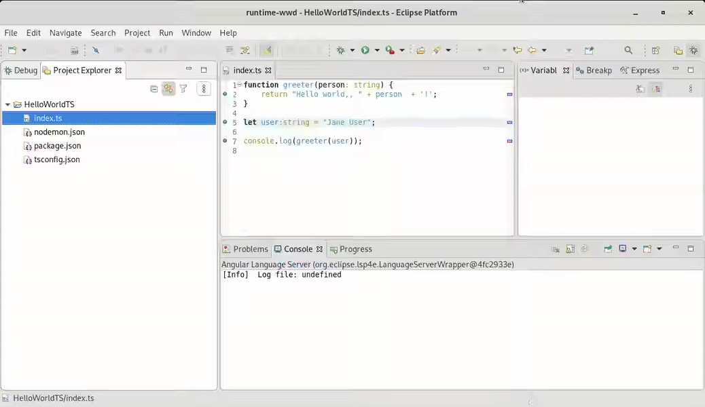
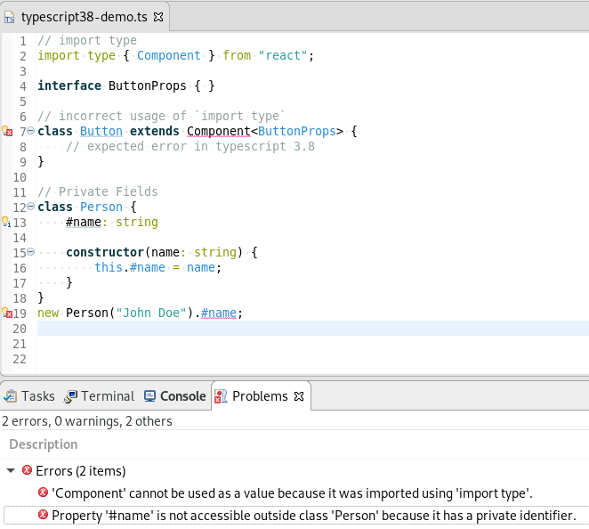
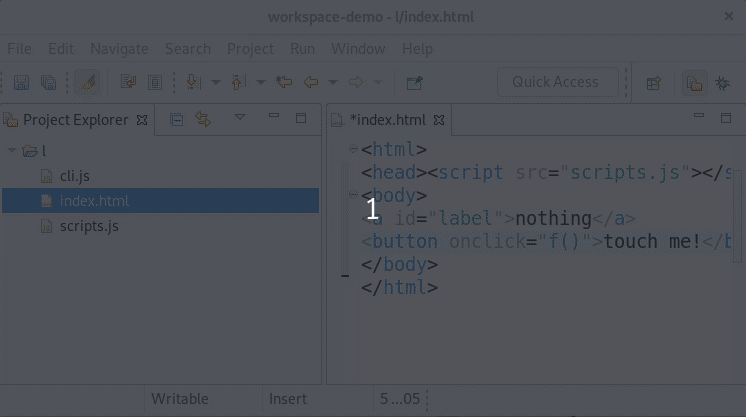
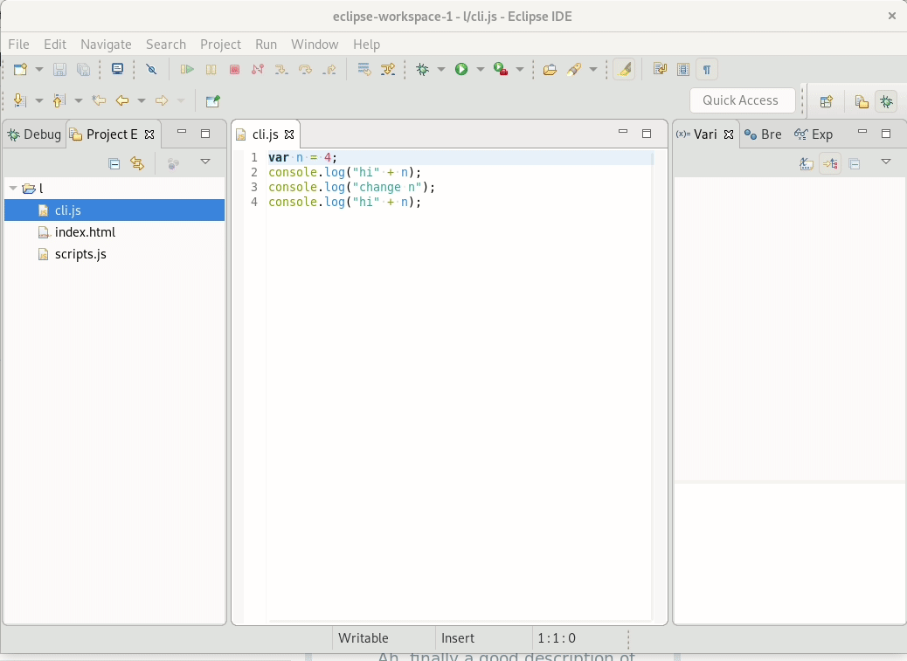

# Eclipse Wild Web Developer: Release notes

This page describes the noteworthy improvements provided by each release of Eclipse Wild Web Developer.

## 1.3.9

* 📅 Release Date: November 19th, 2024
* All changes: https://github.com/eclipse/wildwebdeveloper/compare/1.3.8...1.3.9

#### Editing improvements

* Embed Node.js for Windows Aarch64

## 1.3.8

* 📅 Release Date: November 18th, 2024
* All changes: https://github.com/eclipse/wildwebdeveloper/compare/1.3.7...1.3.8

#### Editing improvements

* Register .cts and .mts file extensions with TypeScript content type

#### Dependencies update

* Use the latest VSCode extensions v.1.95.0 for CSS/HTML/JSON editing
* Embed latest Node.js to v.22.11.0 LTS
* Use the latest Vue.js LS v.2.1.10
* Use the latest Angular LS v.19.0.1
* Other dependency updates

## 1.3.7

* 📅 Release Date: August 28th, 2024
* All changes: https://github.com/eclipse/wildwebdeveloper/compare/1.3.6...1.3.7

#### Editing improvements

* Bugfix for XMLLanguageServer process to properly inherit user.name and user.home

#### Dependencies update

* Update commons-compress to 1.27.1 
* Use the latest YAML Language Server v.1.15.0
* Use the latest Vue.js LS v.2.0.22
* Use the latest TypeScript LS v.4.5.3
* Use LemMinX v.0.28.0 ⚠️ Your lemminx extensions registered to Wild Web Developer may be incompatible if they were built against an older version of LemMinX ⚠️
* Use the latest VSCode extensions v.1.92.0 for CSS/HTML/JSON editing
* Embed latest Node.js to v.20.16.0 LTS
* Use the latest Angular LS v.18.2.0
* Other dependency updates

## 1.3.6

* 📅 Release Date: May 28th, 2024
* All changes: https://github.com/eclipse/wildwebdeveloper/compare/1.3.5...1.3.6

#### Editing improvements

* Bugfix: Ensure that the update site contains org.apache.commons.lang3
* Bugfix: Explicit close in AutoCloseable
* Bugfix: Enable PGP signing in Jenkinsfile

#### Dependencies update

* Update commons-compress to 1.26.2 
* Other dependency updates

## 1.3.5

* 📅 Release Date: May 23th, 2024
* All changes: https://github.com/eclipse/wildwebdeveloper/compare/1.3.4...1.3.5

#### Editing improvements

* Make Status creation and logging less verbose
* Switch CSS/LESS/SCSS to TM4E grammar/language config 
* Use XML grammar from TM4E 

#### Dependencies update

* Require LSP4E v.0.18.9
* Use the latest VSCode extensions v.1.89.0 for CSS/HTML/JSON editing
* Use the latest Angular LS v.17.3.2
* Embed latest Node.js to v.20.13.1 LTS
* Use the latest Vue.js LS v.2.0.19
* Other dependency updates

## 1.3.4

* 📅 Release Date: May 6t, 2024
* All changes: https://github.com/eclipse/wildwebdeveloper/compare/1.3.3...1.3.4

#### Editing improvements

* Allow configuring directory of ESLint package by @PyvesB in #1412
* Bugfix for preferences layout
* Bugfix for wrong path to tsserver
* Include newer snakeyaml (from TM4E repo)
* Move to Java 21 by @akurtakov in #1495
* Enable prototype for launch configs

#### Dependencies update

* Use the latest Vue.js LS v.1.8.27
* Use the latest VSCode ESLint extension v.2.4.4
* Use the latest VSCode extensions v.1.86.0 for CSS/HTML/JSON editing
* Use the latest Angular LS v.17.3.1
* Embed latest Node.js to v.20.12.1 LTS
* Update commons-compress to 1.26.1 
* Other dependency updates

## 1.3.3

* 📅 Release Date: November 21th, 2023
* All changes: https://github.com/eclipse/wildwebdeveloper/compare/1.3.2...1.3.3

#### Editing improvements

* Bugfix for fsevents.node is not signed (repeated)

#### Dependencies update

* Other dependency updates

## 1.3.2

* 📅 Release Date: November 20th, 2023
* All changes: https://github.com/eclipse/wildwebdeveloper/compare/1.3.1...1.3.2

#### Editing improvements

* Bugfix for fsevents.node is not signed

#### Dependencies update

* Use the latest VSCode extensions v..1.84.0 for CSS/HTML/JSON editing

## 1.3.1

* 📅 Release Date: November 15th, 2023
* All changes: https://github.com/eclipse/wildwebdeveloper/compare/1.3.0...1.3.1

#### Editing improvements

* Bugfix for fsevents.node is not signed
* Bugfix for "Chrome Debug Launch configuration
* Bugfix for WebRoot folder validation in Launch configuration
* Bugfix for allow using TypeScript version specified by project
* Bugfix for Run HTML Debug configuration validation
* Bugfix for "Chrome Debug" session start when a chrome window is already open
* Bugfix for Preference pages are not found when searching for "yaml"
* Added autoinsert support for Vue.js
* Bugfix for Maven build use node from PATH on mac os
* Added Support for Syntactic and Semantic server modes for Vue.js
* Use vscode-js-debug instead of deprecated node-debug2 and for Chrome 
* Bugfix for Read host name from output when debugging
* Bugfix for Resolve ts->js mapping relative to rootDir
* Bugfix for Use "outputCapture": "std" for Node launches
* Bugfix for Drop Thread.sleep from reconcilers
* Bugfix for Adjusting priority for JS/TS content types

#### Dependencies update

* Snakeyaml dependency is added to WWD repository
* Switched to use TM4E's own repository to use the most latest release
* Added 'fsevents' NPM dependency for MacOS users
* Use the latest Vue.js LS to v.1.8.22
* Use the latest VSCode extensions v..1.83.0 for CSS/HTML/JSON editing
* Embed latest Node.js to v.18.18.2 LTS with the latest Security Fixes
* Use the latest Firefox Debug adapter v.2.9.9
* Use the latest TypeScript LS v.4.0.0
* Use the latest Angular LS v.17.0.2
* Other dependency updates

## 1.3.0

* 📅 Release Date: August 11th, 2023
* All changes: https://github.com/eclipse/wildwebdeveloper/compare/1.2.0...1.3.0

#### Editing improvements

* Bugfix for Run Chrome/Firefox Debug launch configurations to save edited values
* Bugfix for Run Debug HTML launch configurations validation for edited values
* Bugfix for "No grammar provided for <vue.sfc.style.variable.injections>" error
* Bugfix for "Disable download external resources by default" 
* Bugfix for XML LS (Lemminx) configuration preferences using wrong/not supported values

#### Dependencies update

* Use the latest Vue.js LS to v.1.8.8
* Use the latest Angular LS to v.16.1.4
* Use the latest YAML Language Server v.1.14.0
* Use LemMinX v.0.27.0 ⚠️ Your lemminx extensions registered to Wild Web Developer may be incompatible if they were built against an older version of LemMinX ⚠️
* Embed latest Node.js to v.18.17.1 LTS  with the latest Security Fixes
* Other dependency updates

## 1.2.0

* 📅 Release Date: June 30th, 2023
* All changes: https://github.com/eclipse/wildwebdeveloper/compare/1.1.1...1.2.0

#### Editing improvements

* Allow configuring maxTsServerMemory parameter for JS/TS language server
* Added support for Vue.js editing

#### Dependencies update

* Use the latest VSCode ESLint extension v.2.4.2
* Use the latest VSCode extensions v..1.79.0 for CSS/HTML/JSON editing
* Use LemMinX 0.26.1 ⚠️ Your lemminx extensions registered to Wild Web Developer may be incompatible if they were built against an older version of LemMinX ⚠️
* Embed latest Node.js (v.18.16.1) with the latest Security fixes

## 1.1.1

* 📅 Release Date: May 25th, 2023
* All changes: https://github.com/eclipse/wildwebdeveloper/compare/1.1.0...1.1.1

#### Editing improvements

* Bugfix for "ESLint errors not showing in jsx files" 
* Bugfix for "Errors in tsx since upgrading to 1.0.0"
* Bugfix for "Refactorings->Rename doesn't work for TypeScript files" upstream issue (Requires updating to LSP4E v.0.23.0)

#### Dependencies update

* Use the latest VSCode ESLint extension v.2.4.1
* Use the latest VSCode extensions v..1.78.2 for CSS/HTML/JSON editing
* Use the latest YAML Language Server v.1.13.0

## 1.1.0

* 📅 Release Date: May 5th, 2023
* All changes: https://github.com/eclipse/wildwebdeveloper/compare/1.0.5...1.1.0

#### Editing improvements

* Updated the TypeScript/JavaScript Grammars

#### Dependencies update

* Embed latest Node.js (v.18.16.0) with the latest Security fixes
* Use the latest VSCode extensions v..1.78.0 for CSS/HTML/JSON editing
* Use LemMinX 0.25.0 ⚠️ Your lemminx extensions registered to Wild Web Developer may be incompatible if they were built against an older version of LemMinX ⚠️
 * Updated language servers

## 1.0.5

* 📅 Release Date: April 22nd, 2023
* All changes: https://github.com/eclipse/wildwebdeveloper/compare/1.0.4...1.0.5

#### Dependencies update

* Embed latest Node.js (v.18.16.0) with the latest Security fixes
* Use LemMinX 0.24 ⚠️ Your lemminx extensions registered to Wild Web Developer may be incompatible if they were built against an older version of LemMinX ⚠️
 * Updated language servers

## 1.0.4

* 📅 Release Date: April 6th, 2023
* All changes: https://github.com/eclipse/wildwebdeveloper/compare/1.0.3...1.0.4

#### Editing improvements

* XML catalogs are able to be contributed from a plugin
* Bugfix for "Unsupported request method: eslint/noConfig" error 
* Updated the TypeScript/JavaScript Grammars

#### Dependencies update

* Embed latest Node.js (v.18.15.0) with the latest Security fixes
* Use the latest VSCode extensions v..1.77.0 for CSS/HTML/JSON editing

## 1.0.3

* 📅 Release Date: March 8th, 2023
* All changes: https://github.com/eclipse/wildwebdeveloper/compare/1.0.2...1.0.3

#### Editing improvements

* Bugfix to `Typescript override keyword is not highlighted`
* Bugfix to `Installation of latest release fails`

#### Dependencies update

* Use the latest VSCode extensions v..1.76.0 for CSS/HTML/JSON editing 
* Use the latest YAML Language Server v.1.12.0

## 1.0.2

* 📅 Release Date: February 28th, 2023
* All changes: https://github.com/eclipse/wildwebdeveloper/compare/1.0.1...1.0.2

#### Editing improvements

* Improved support for tsconfig.json
* New XML formatting preferences
* Support configurable log level for LemMinX
* Try being more tolerant when reading XML catalog 
* Bugfix to Debugging TypeScript in non-root folder
* Added launch/debug support for `*.cjs` (Coommon JS) files
* Bugfix to Angular Language Server pop-up error
* Bugfx to 'Unknown at rule' on file extensions associated with content type LESS
* Bugfix for Typescript analysis broken - TypeScript Language Server is forced to use the WWD provided `tsserver.js`
* Bugfix to `Unsupported notification method: $/typescriptVersion`

#### Dependencies update

  * Use newer Node.js (18.13.0) internally
  * Updated language servers
  * Use LemMinX 0.23 ⚠️ Your lemminx extensions registered to Wild Web Developer may be incompatible if they were built against an older version of LemMinX ⚠️

## 1.0.1

* 📅 Release Date: November 27th, 2022
* All changes: https://github.com/eclipse/wildwebdeveloper/compare/1.0.0...1.0.1

* Show a code mining action to bind schema/grammar (XSD, DTD, RelaxNG) with codelens in XML file
* UI preferences for TypeScript/ Javascript Inlay Hints 
* Embedded node.js now installed in the IDE installation folder (instead of workspace)
* Bugfix to better detect tsconfig.json files when debugging .ts files. This usually makes debugger work better out of the box.
* Bugfix ESLint support
* Update dependencies

## 1.0.0

* 📅 Release Date: November 4th, 2022
* All changes: https://github.com/eclipse/wildwebdeveloper/compare/0.15.0...1.0.0

#### Editing improvements
  * XML auto closing tag  
  * RelaxNG support : XML validation, completion hover based on RelaxNG schema  
  * Syntax coloration for DTD
  * Syntax coloration / language configuration for RelaxNG compact syntax (.rng)
  * HTML auto closing tag and auto creation of quotes for HTML attribute assignment
  * HTML preferences (without spaces/tabs configuration)
  * CSS preferences (without spaces/tabs configuration)
  
#### Dependencies update

  * Use newer Node.js (18.12.0) internally
  * Updated language servers
  * Use LemMinX 0.22 ⚠️ Your lemminx extensions registered to Wild Web Developer may be incompatible if they were built against an older version of LemMinX ⚠️

## 0.15.1

* 📅 Release Date: October 13th, 2022
* All changes: https://github.com/eclipse/wildwebdeveloper/compare/0.15.0...0.15.1

#### Dependency and inclusions updates
  * Embedded Node.js
  * TypeScript, Angular and related language servers updated
  * Newer Eclipse Platform and other dependencies updated
  
#### Editing improvements
  * XML Formatting preference page is added
  * An option to download external resources like referenced DTD, XSDSupport is added
  * Support for OnEnterRules for xml, html, js and ts files - indentation rules are added
  
### Other bugfixes and improvements

## 0.15.0

* 📅 Release Date: July 29th, 2022
* All changes: https://github.com/eclipse/wildwebdeveloper/compare/0.13.6...0.15.0

#### Incompatibility: LemMinX 0.21.0

Wild Web Developer now includes LemMinX 0.21.0. This version has some API change that may break existing extensions. So if you do include a LemMinX extension via Wild Web Developer extension point, your extension will be likely failing. Remediation to to update your LemMinX extension to use LemMinX 0.21.0 and then include this new version of your extension in your Wild Web Developer extension plugin.


## 0.13.6

* 📅 Release Date: July 7th 2022
* All changes: https://github.com/eclipse/wildwebdeveloper/compare/0.13.5...0.13.6

* Use Java 17
* Bugfixes

## 0.13.5

* 📅 Release Date: May 29th 2022
* All changes: https://github.com/eclipse/wildwebdeveloper/compare/0.13.4...0.13.5

* Dependency and inclusions updates
  ** Embedded Node.js
  ** TypeScript, Angular and related language servers
  ** Newer Eclipse Platform and other dependencies updated

## 0.13.4

* 📅 Release Date: April 11th 2022
* All changes: https://github.com/eclipse/wildwebdeveloper/compare/0.13.3...0.13.4

* Dependency and inclusions updates
  ** Embedded Node.js
  ** LemMinX language server 0.19.1
  ** Newer Eclipse Platform and other dependencies updated
* Better support for JSX & TSX (recognized as JS/TS files, and for some config files, now recognized as json.
* Support Eclipse variables in Launch Configuration (so they're more portable)
* Other bugfixes and improvements

## 0.13.3

* 📅 Release Date: February 8th, 2022
* All changes: https://github.com/eclipse/wildwebdeveloper/compare/0.13.2...0.13.3

Bugfixes, update of dependencies and releng improvements

## 0.13.2

* 📅 Release Date: January 13th, 2022
* All changes: https://github.com/eclipse/wildwebdeveloper/compare/0.13.1...0.13.2

Bugfixes, update of dependencies and releng improvements

## 0.13.1

* 📅 Release Date: November 9th, 2021
* All changes: https://github.com/eclipse/wildwebdeveloper/compare/0.13.0...0.13.1

#### Update Language Servers

Updated most language servers, including LemMinX-Maven.

#### Support .cjs and .mjs files as JavaScript

Registered those extensions as JavaScript files so they get edition assistance.

#### Update build machinery and other dependencies

## 0.13.0

* 📅 Release Date: September 23rd, 2021
* All changes: https://github.com/eclipse/wildwebdeveloper/compare/0.12.0...0.13.0

#### Fix XML catalog in case of schemas provided by plugins

The catalog now properly resolve schemas that were installed in WebTools from plugins. Under the hood, the `platform:/...` URIs are now resolved to `file:/...` URIs that the language server can understand.

This should allow better integration with WebTools catalog, and the multiple schemas provided by plugins like Java/Jakarta EE support.

#### IDE package for macos/aarch64

You can now find in the download area an IDE package dedicated to macos with aarch64 (M1) processors. This should perform more efficiently than the macos/x86_64 package on newer machines.

#### Use LemMinX 0.18.0

XML support was updated to use LemMinX 0.18.0 (was 0.16.2). As a consequence, plugins providing extension for Wild Web Developer XML support should consider moving their requirements to LemMinX 0.18 and `org.eclipse.wildwebdeveloper.xml` 0.13.0.

#### Other updates

* Node is now in version 14.17.1
* Most npm-based language servers were updated to their latest release


### Previous releases...

## 0.12.0

* 📅 Release Date: June 21st, 2021
* All changes: https://github.com/eclipse/wildwebdeveloper/compare/0.11.6...0.12.0

#### Use LemMinX 0.16

XML support was updated to use LemMinX 0.16.2 (was 0.15.0). As a consequence, plugins providing extension for Wild Web Developer XML support should consider moving their requirements to LemMinX 0.16 and `org.eclipse.wildwebdeveloper.xml` 0.12.0.

## 0.11.6

* 📅 Release Date: March 29th, 2021
* All changes: https://github.com/eclipse/wildwebdeveloper/compare/0.11.5...0.11.6

#### Updated Eclipse target platform and Language Servers

Use Eclipse Platform 4.19/2021-03 and Language Servers for VSCode 1.54 and newer Yaml Language Server. See respective release notes to learn more.

#### Log message for specific Angular and ESLint LS operations

Also not all language-server specific operations are supported, most of them are now logged for easier troubleshooting.

## 0.11.5

* 📅 Release Date: March 3rd, 2021
* All changes: https://github.com/eclipse/wildwebdeveloper/compare/0.11.4...0.11.5

#### Added IDE packages

IDE packages tailored for usage of Wild Web Developer are now built and published with Wild Web Developer.

#### Use newer LemMinX 0.15

Wild Web Developer uses LemMinX 0.15 now (so extensions built for LemMinX 0.14 and lower and contributed via Wild Web Developer may not work any more).

#### Added support for opening doc on ESLint warnings

Contextual actions show on ESLint error that consist in opening documentation are now correctly handled.

#### XML Preference pages

New XML Preference pages allow to configure CodeLens, Validation/Resolution.

#### WTP defined catalog extensions now included

The catalog extensions defined using WTP XML catalogs extension point are now used to populate the system catalog.

## 0.11.4

* 📅 Release Date: December 1st, 2020
* All changes: https://github.com/eclipse/wildwebdeveloper/compare/0.11.3...0.11.4

#### Added 'Schema Associations' preference page for JSON and YAML
- A new preference page 'Schema Associations' in the category 'General' was introduced. In favour of that, the existing YAML preference page was removed.
- This enables the user to associate content types to a JSON or YAML schema, defined by url or local file location.
- Default content types and schema associations are defined for the most common web editor related JSON files (e.g. package.json, .eslintrc).

#### Upgraded all language servers

Edition assistance should be improved on many aspects, and several bugs now fixed.

#### Refactored ESLint support

ESLint support is now a standalone language server, which doesn't require TypeScript, tsconfig nor anything else tan plain ESLint configuration files to work. The support now use the same language server has the VSCode ESLint extension, which delegates to the ESLint command available in customer's `node_modules` folder.

#### Trimmed embedded node_modules

Less `node_modules` are embedded, this should result in a reduced disk footprint.

#### Enable upgrade of "web" components without upgrading XML support

This allows to more easily installed Wild Web Developer beside potentially conflicting/restratining 3rd party features and plugins.

## 0.11.3

* 📅 Release Date: 23rd September 2020
* All changes: https://github.com/eclipse/wildwebdeveloper/compare/0.11.2...0.11.3

#### Upgraded YAML language server

Adds support for some new yaml features.

## 0.11.2

* 📅 Release Date: 15th September 2020
* All changes: https://github.com/eclipse/wildwebdeveloper/compare/0.11.1...0.11.2

#### Upgraded Angular and YAML language servers

This fixes a few bugs, and improves support for some new yaml features.

## 0.11.2

* 📅 Release Date (tentative): 15th September 2020
* All changes: https://github.com/eclipse/wildwebdeveloper/compare/0.11.1...0.11.2

#### Upgraded Angular and YAML language servers

This fixes a few bugs, and improves support for some new yaml features.


## 0.11.1

* 📅 Release Date: 3rd, August 2020
* All changes: https://github.com/eclipse/wildwebdeveloper/compare/0.11.0...0.11.1

#### Add Node.js embedder for aarch64

Wild Web Developer now ships a node embedded for aarch64.

#### Upgrade language servers and debug adapters

which includes...

#### Support for TypeScript 3.9

Upgrade of typescript and tsserver bring 3.9 support out of the box


## 0.11.0

* 📅 Release Date: 16th July 2020
* All changes: https://github.com/eclipse/wildwebdeveloper/compare/0.10.0...0.11.0

#### Embedded Node.js

Node.js is now embedded into Wild Web Developer. Unless the `"org.eclipse.wildwebdeveloper.nodeJSLocation"` system property is set and developer's system suits the supported OSs (Linux, MacOS and Win32) and architectures (x86_64), the embedded version of Node.js will be used by Language Servers and Node Debugger. 

By adding the `org.eclipse.wildwebdeveloper.embedder.node.feature` into the dependencies, developers might use the Node.js Embedder's `NodeJSManager` class in order to automatic install/use of the embedded version of Node.js in their products.

#### TypeScript program debug support

TypeScript programs can now be directly debugged using `Node program` Debug Configuration.



### XML Catalogs preference page

You can now define XML catalogs via preference page.

### Language Servers update

Most language servers got updated to their latest version, bringing new features and bugfixes.

### ⚠️ Breaking extensions ⚠️ Move to LemMinX 0.12.0

LemMinX XML language server was upgraded to 0.12.0, with a lot of improvements. However, please note that the extension API has changed in a non-backward compatible way; so to work with newer Wild Web Developer, ensure the extensions to `org.eclipse.wildwebdeveloper.xml.lemminx` are compatible with LemMinX 0.12.0.

## 0.10.0

* 📅 Release Date (tentative): Early June 2020
* All changes: https://github.com/eclipse/wildwebdeveloper/compare/0.9.1...0.10.0

#### Extension point to define initializationOptions to LemMinX XML Language Server

The extension point `org.eclipse.wildwebdeveloper.xml` now allows a new `initializationOptionsProvider` child element type, which can be used to specify some initialize options. This is typically useful for language server who should be configured according some some user preferences already configured somewhere else in the IDE, so such preferences can be propageted to the language server.

#### Extension point to define JSON Schema URLs

The extension point `org.eclipse.wildwebdeveloper.json.schema` allows record JSON schema for filename pattern. This records are registered in JSON Language Server during initialization:

```xml
<extension point="org.eclipse.wildwebdeveloper.json.schema">
      <schema pattern="composer.json" url="http://json.schemastore.org/composer" />
</extension>
```

## 0.9.1

* 📅 Release Date: May 4th 2020
* All changes: https://github.com/eclipse/wildwebdeveloper/compare/0.9.0...0.9.1

#### Support for Node.js 14

Wild Web Developer was successfully tested against node.js 14, so it's been added to the list of compatible versions, and no warning pop-up will show for users of Node.js 14.

#### Install XML support separately

A feature containing XML editor was extracted and can be installed separately, without installing all other Web tools (HTML, JS and so on).


## 0.9.0

* 📅 Release Date: April 15th, 2020
* All changes: https://github.com/eclipse/wildwebdeveloper/compare/0.8.3...0.9.0

#### Breaking changes

* Extension point `org.eclipse.wildwebdeveloper.lemminxExtension` now replaces `org.eclipse.wildwebdeveloper.xmllsExtension`
* Interface `LemminxClasspathExtensionProvider` now replaces `XMLLSClasspathExtensionProvider`
* XML Language server is now Eclipse Lemminx 0.11.0. Extensions must be built targetting this language server (package name have changed)

#### Select Chrome/Chromium instance in Debug configurations

When debugging against Chrome/Chromium, the related Debug Configurations now shows an extra tab that allow to select the browser instance to use. This is convenient when user has multiple instances of Chrome/Chromium installed and want to test against multiple ones. The default behavior didn't change and will look for a relevant instance in the PATH.

## 0.8.3

* 📅 Release Date: March 19th, 2020
* All changes: https://github.com/eclipse/wildwebdeveloper/compare/0.8.2...0.8.3

#### TypeScript 3.8 support

Wild Web Developer supports the latest release of TypeScript, 3.8




## 0.8.2

* 📅 Release Date: February 20th, 2020
* All changes: https://github.com/eclipse/wildwebdeveloper/compare/0.8.1...0.8.2

#### NPM Launch shortcut

Easily invoke NPM with the new NPM Launch shortcut under "Run As" context-menu for `package.json` file and editor, or by defining your Run Configuration.

▶️ https://www.screencast.com/t/iFg4QUTo28Rb

#### Easily define root mapping for remote node.js debugger

When debugging a remote process on a different filesystem, the related Debug Configuration now allows to easily define the root and local path to map together, so breakpoint and file references are correctly used by both client and server

▶️ https://www.screencast.com/t/oECdEsORLr6X

## 0.8.1

📅 Release Date: January 20th, 2020

#### Proxy honored for XML resolution

The proxy settings are now used by the XML edition assistance (eg to resolve XSD elements). The network settings of Eclipse IDE are used, and if the network settings are blank, the related System Properties of the running/host Eclipse process itself are forwarded to XML resolution. _This fixes issue #192._  

#### ESLint and Typescript-ESLint support

[ESLint](https://eslint.org/) is now supported in Wild Web Developer, providing both code diagnostics and quick fixes (when available) for JavaScript and Typescript files.

To enable ESLint for a project, a `.eslintrc`, `tsconfig.json` as well as the required `node_modules` must reside within the project's directory (or in a parent directory). The required `node_modules` can be installed with `npm install eslint@6.0.0 @typescript-eslint/eslint-plugin@2.7.0 @typescript-eslint/parser@2.7.0 typescript@3.6.4`.

An example `.eslintrc` can be found [here](org.eclipse.wildwebdeveloper.tests/testProjects/eslint/.eslintrc) and a example `tsconfig.json` can be found [here](org.eclipse.wildwebdeveloper.tests/testProjects/eslint/tsconfig.json)  

For more information on configuring ESLint, visit https://eslint.org/docs/user-guide/configuring.

▶️ Demo of ESLint in Wild Web Developer https://youtu.be/o-wI_niEz3E

#### Improved XML language server extensibility

Extension point to add jars to XML Language Server has been augmented to allow passing a dynamic resolution of multiple jars.

## 0.8.0

📅 Release Date: 19th November, 2019

#### XML language server extension support

XML-LS extension jars can now be integrated into Wild Web Developer through the xmllsExtension extension point, allowing additional functionality to be provided from the language server.

The extension jars must implement the **IXMLExtension interface** and must register with Java Service Provider Interface (SPI) mechanism in the **/META-INF/services/org.eclipse.lsp4xml.services.extensions.IXMLExtension** file.
To use the extension point, create an xmllsExtension extension in a plug-in project and set the path to the location of the extension jar (which must reside within the plug-in project).

Usage example:

```xml
    <extension
          point="org.eclipse.wildwebdeveloper.xml.xmllsExtension">
       <jar
             path="path/to/extension.jar">
       </jar>
    </extension>
```

## 0.7.0

📅 Release Date: October 11th, 2019

##### Angular template edition assistance (in HTML and TypeScript)

Wild Web Developer adopts new version of the ng-language-server, and includes support for rich edition
assistance (validation, completion, go to definition...) for template strings in TypeScript files and
template HTML files, among other Angular-specific features.

▶️ https://www.screencast.com/t/6GTi4jf6svR

## 0.6.0

📅 Release Date: September 27th, 2019

##### Debug with Chrome

##### Improved Debug As > Firefox/Chrome shortcuts to run on folders when they have some .html file 

Full list of changes: https://github.com/eclipse/wildwebdeveloper/compare/0.5.0...0.6.0

See also https://projects.eclipse.org/projects/tools.wildwebdeveloper/releases/0.6.0

## 0.5.0 (2019 Sep 18th)

📅 Release Date: September 18th, 2019

##### Added icons for supported file types

##### Upgraded all language servers (many small improvements to edition features)
##### Work with Node.js 11 and 12
##### Format HTML

##### Debugging doesn't log noisy messages in the Console any more
This messages were useful for debugging integration with debug adapter. They can still be enabled in the Launch Configuration "Debug Adapter" tab; they're simply turned off by default.
##### Change variable values during debug

##### Debug with Firefox Debug Adapter
[](https://www.youtube.com/watch?v=4Q_-CtvsEjY)
##### Improve usability of the Debug launchers
TODO: demo video


Full list of changes: https://github.com/eclipse/wildwebdeveloper/compare/0.4.1...0.5.0

See also https://projects.eclipse.org/projects/tools.wildwebdeveloper/releases/0.5.0 

## Previous releases

No release notes were maintained before that.
